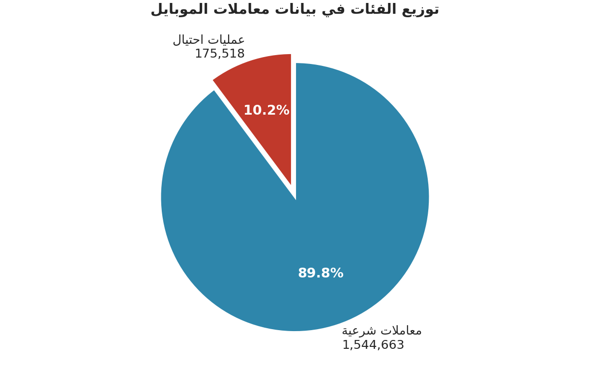
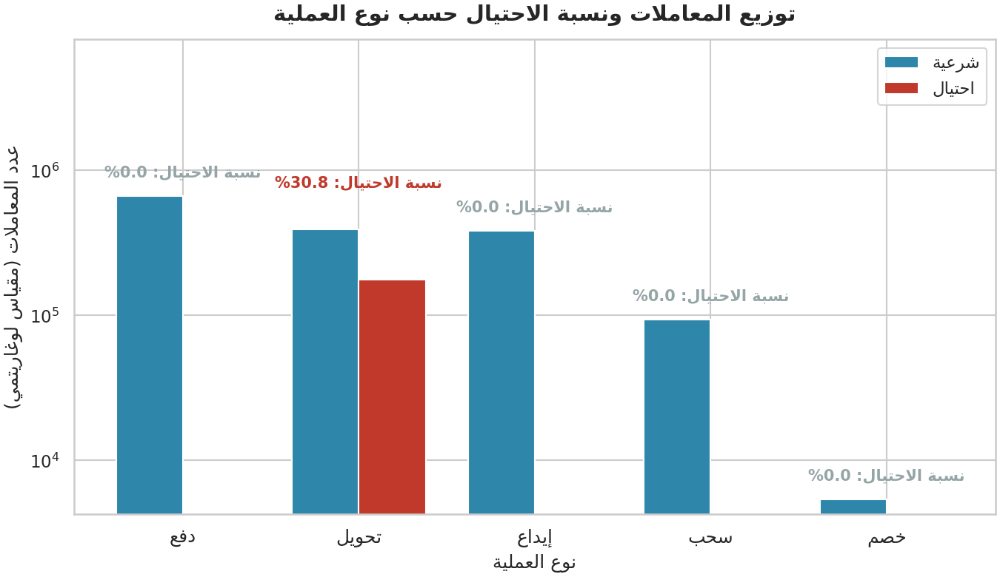
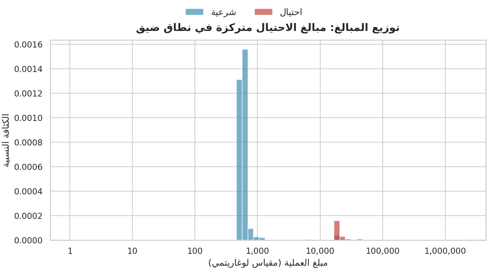
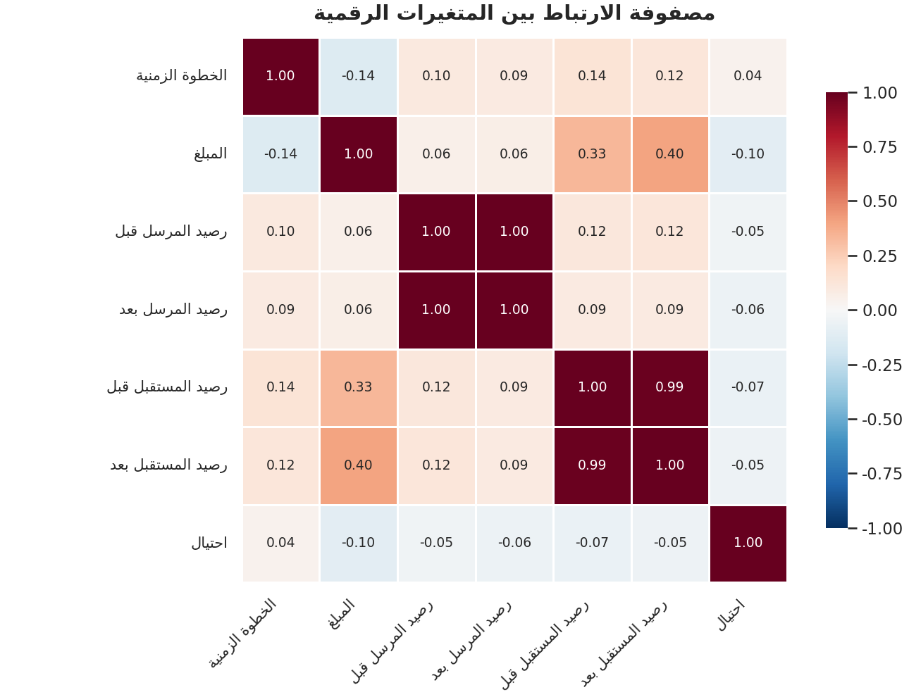
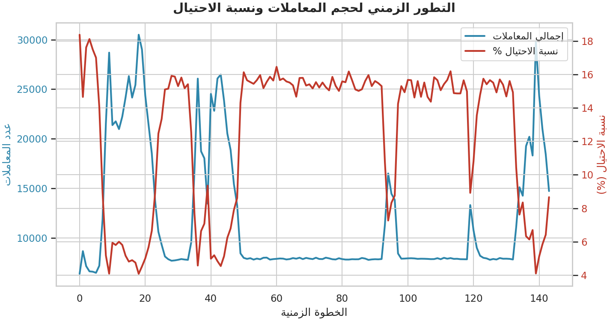
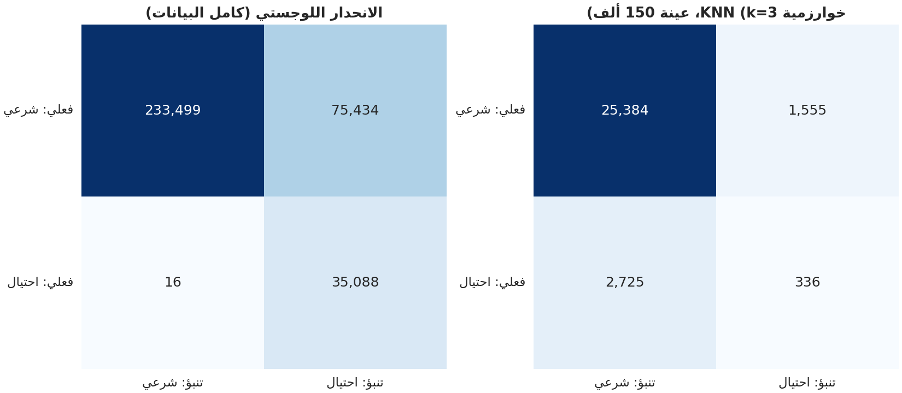
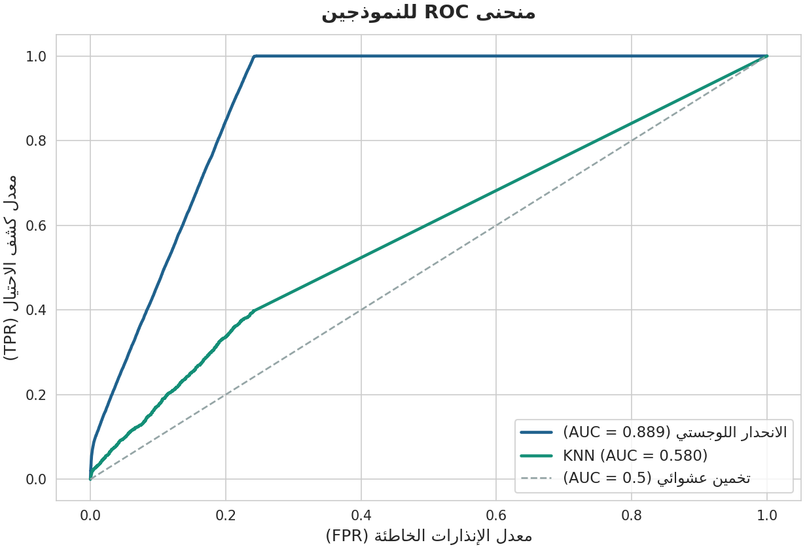
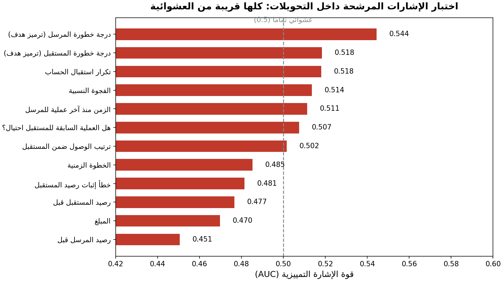

# 🕵️ كشف الاحتيال في مدفوعات الموبايل باستخدام تعلم الآلة

**Mobile Money Fraud Detection using Machine Learning**

مشروع تطبيقي لمقرر علم البيانات — بناء نموذج لتصنيف معاملات الموبايل موني
(شرعية / احتيال) باستخدام الانحدار اللوجستي وخوارزمية الجيران الأقربين KNN.

| | |
|---|---|
| **الطلاب** | أحمد علي المتوكل — محمد نجيب العواضي |
| **الخوارزميات** | Logistic Regression + K-Nearest Neighbors |
| **حجم البيانات** | 1,720,181 معاملة × 10 أعمدة (156 MB) |
| **التقسيم** | 80% تدريب / 20% اختبار (طبقي) |
| **المقاييس** | Accuracy, Precision, Recall, F1-Score, ROC-AUC |

---

## 📖 نظرة عامة على المشروع

انتشرت خدمات الموبايل موني في الأسواق الناشئة بشكل هائل، ومعها انتشر
الاحتيال المالي. هذا المشروع يبني نظاماً كاملاً لاكتشاف العمليات الاحتيالية
انطلاقاً من بيانات معاملات تركيبية واقعية البنية، مع التركيز على السؤال
الأهم في مسائل الاحتيال: **كيف نصطاد اللصوص دون اتهام الأبرياء؟**

القصة التحليلية للمشروع تدور حول ثلاث حقائق:

1. **فخ الدقة (Accuracy Trap):** نسبة الاحتيال 10.2% فقط، أي أن نموذجاً
   أحمق يتنبأ بأن كل معاملة شرعية يحقق دقة **89.8%** دون أن يمسك بلص واحد!
   لذلك الدقة وحدها مقياس خادع، و**الاستدعاء (Recall)** هو المقياس الحقيقي.

2. **قاعدة بسيطة قوية:** الاستكشاف كشف أن الاحتيال يحدث **حصرياً** في
   عمليات التحويل (TRANSFER). قاعدة "كل تحويل = احتيال" تحقق استدعاء 100%
   لكنها تتهم **393,810 بريئاً** بالاحتيال (ضبط 30.8% فقط).

3. **سقف الأداء:** أثبتنا بتحليل منهجي لـ 12 إشارة مرشحة (انظر المرحلة 4)
   أن الاحتيال داخل التحويلات موزع شبه عشوائي في هذه البيانات، ما يجعل
   أداء القاعدة البسيطة هو السقف العملي — ونموذجنا اللوجستي يصل إلى هذا
   السقف ويتجاوز القاعدة في 3 من 4 مقاييس.

---

## 🗂️ البيانات

**المصدر:** [Synthetic Mobile Money Transaction Dataset](https://data.mendeley.com/datasets/zhj366m53p/1)
— Mendeley Data، منشورة في دورية IEEE Access (2024).

| الخاصية | القيمة |
|---|---|
| عدد المعاملات | 1,720,181 |
| عدد الأعمدة | 10 |
| الحجم | 156 MB |
| القيم المفقودة | 0 |
| الصفوف المكررة | 0 |
| نسبة الاحتيال | 10.2% (175,518 عملية) |

الأعمدة: الخطوة الزمنية، نوع العملية، المبلغ، حساب المُرسل ورصيديه قبل
وبعد، حساب المستقبِل ورصيديه قبل وبعد، ووسم الاحتيال `isFraud`.

> ⚠️ الملف غير مضمّن في المستودع لتجاوزه حد GitHub (100MB) —
> راجع [data/README.md](data/README.md) لطريقة التحميل والتحقق.

---

## 🔍 أبرز نتائج الاستكشاف (EDA)

| # | الاكتشاف | التفصيل |
|---|---|---|
| 1 | الاحتيال حصري في التحويلات | 175,518 عملية احتيال كلها TRANSFER (30.8% من التحويلات)، وصفر في الأنواع الأربعة الأخرى |
| 2 | حسابات التجار محصّنة | 1,150,853 معاملة لتجار ("XX-XXXXXXX") بدون أي احتيال |
| 3 | المبالغ متداخلة | 75% من مبالغ الاحتيال ≤ 24.6K مقابل 27.4K للشرعية — لا يوجد حد فاصل واضح |
| 4 | أرصدة سالبة | 44,621 حالة رصيد مُرسل سالب (حتى -199,997) عوملت كميزة راية بدل حذفها |
| 5 | توزيع زمني متغير | نسبة الاحتيال تتذبذب عبر الزمن (متوسط 12.45% ± 4.35 لكل خطوة) |

| الرسم | الوصف |
|---|---|
|  | اختلال الفئات 89.8% / 10.2% |
|  | الاحتيال حصري في التحويلات |
|  | تداخل توزيعات المبالغ |
|  | ارتباطات ضعيفة مع الاحتيال |
|  | تطور المعاملات والاحتيال زمنياً |

---

## 🛠️ المنهجية — خط الإنتاج بأربع مراحل

```
البيانات الخام ──► 01_eda ──► 02_preprocess ──► 03_train_evaluate ──► 04_signal_analysis
 (1.72M صف)      استكشاف      تنظيف + 16 ميزة      نمذجة وتقييم        تحليل سقف الأداء
                  6 رسوم       (انظر أدناه)        9 رسوم + JSON        12 إشارة مختبرة
```

### المرحلة 2 — المعالجة وهندسة الميزات (16 ميزة)

- **تنظيف:** التحقق من المفقود والمكرر (صفر لكليهما) — البيانات نظيفة أصلاً
- **قرار الأرصدة السالبة:** الإبقاء على 44,621 حالة + ميزتا راية بدل الحذف
- **التحويل اللوغاريتمي الموقّع** للمبالغ والأرصدة (ترويض الالتواء الحاد مع
  الحفاظ على الإشارة)
- **ترميز One-Hot** لأنواع العمليات الخمسة
- **ميزات فجوة الرصيد:** `amount − oldBalInitiator` والفجوة النسبية
- **خطأ إثبات رصيد المستقبِل:** الفرق بين المبلغ المرسل والمقيَّد

### المرحلة 3 — النمذجة

- تقسيم **80/20 طبقي** (يحافظ على نسبة الاحتيال في الجزئين)
- **الانحدار اللوجستي** على كامل بيانات التدريب (1,376,144 صف) مع
  `class_weight='balanced'` لموازنة فئة الأقلية + توحيد المقياس
- **KNN** على عينة طبقية 150 ألف صف (خوارزمية كثيفة الحساب) مع اختيار
  `k` عبر مجموعة تحقق: جربنا k ∈ {3, 7, 15} والأفضل **k=3**
- خطا أساس للمقارنة: النموذج الساذج والقاعدة البسيطة

---

## 📊 النتائج النهائية

| النموذج | Accuracy | Precision | Recall | F1 | ROC-AUC |
|---|---:|---:|---:|---:|---:|
| نموذج ساذج (الكل شرعي) | 89.80% | 0.00% | 0.00% | 0.00% | — |
| قاعدة بسيطة (كل تحويل احتيال) | 77.07% | 30.79% | 100.00% | 47.09% | — |
| **الانحدار اللوجستي (كامل)** | 78.07% | **31.75%** | **99.95%** | **48.19%** | **0.889** |
| الانحدار اللوجستي (عينة 150K) | 77.87% | 31.55% | 99.97% | 47.97% | 0.886 |
| KNN (k=3، عينة 150K) | 85.73% | 17.77% | 10.98% | 13.57% | 0.580 |

**قراءة النتائج:**

- الانحدار اللوجستي **يتفوق على القاعدة البسيطة** في الضبط (+0.96 نقطة
  مع استدعاء شبه متطابق) وفي F1 والدقة — مع ميزة جوهرية إضافية: يعطي
  **احتمالية** قابلة للضبط (منحنى ROC أعلاه) بدل إجابة نعم/لا جامدة، وهو
  ما يسمح بموازنة تكلفة إنذار خاطئ مقابل تكلفة تسريب احتيال.
- **KNN فشل** (AUC = 0.58): الإشارة الفعالة شبه أحادية البعد (نوع العملية)
  بينما المسافة الإقليدية تُحسب عبر 16 بُعداً — الإشارة تضيع في الضجيج
  (لعنة الأبعاد)، يضاف إليها عدم توازن الفئات وغياب أي بنية محلية هندسية
  داخل التحويلات.

| مصفوفة الالتباس ومقارنة النماذج | منحنى ROC |
|---|---|
|  |  |

---

## 🧪 المرحلة 4 — لماذا لا يتفوق أي نموذج على القاعدة البسيطة؟

اختبرنا القوة التمييزية (AUC) لكل إشارة مرشحة **داخل التحويلات** حيث يقع
الاحتيال كله:

| الإشارة المختبرة | AUC |
|---|---:|
| المبلغ | 0.470 |
| رصيد المُرسل قبل العملية | 0.451 |
| الفجوة النسبية (الاستنزاف) | 0.514 |
| تكرار استقبال الحساب | 0.518 |
| درجة خطورة المستقبِل (ترميز هدف منعَّم) | 0.518 |
| درجة خطورة المُرسل (ترميز هدف منعَّم) | 0.545 |
| ترتيب الوصول / العملية السابقة / الزمن بين العمليات | ≈ 0.50–0.51 |
| **إشارة نوع العملية (للمقارنة، على كامل البيانات)** | **0.873** |

كل الإشارات قريبة من العشوائية (0.5) — الاحتيال موزع شبه عشوائي بين
التحويلات في هذه البيانات التركيبية. هذا يجعل "علّم كل التحويلات" هو
الحل الأمثل تقريباً، وهو ما تعلمه النموذج اللوجستي تلقائياً. النتيجة
العملية: أي تحسين حقيقي يتطلب بيانات أغنى (بصمة الجهاز، حدود السرعة،
تحليل شبكة الحسابات) — وهو توصيتنا الرئيسية.



---

## 🚀 التشغيل

### الطريقة الأسهل: دفتر Jupyter (موصى به)

```bash
# 1) تثبيت المتطلبات
pip install -r requirements.txt jupyter

# 2) تحميل البيانات إلى مجلد data/ (انظر data/README.md)

# 3) فتح الدفتر وتنفيذ كل الخلايا (خلايا النتائج والرسوم العشرة منفّذة ومحفوظة فيه أصلاً)
jupyter notebook mobile_money_fraud_detection.ipynb
```

### أو تشغيل خط الإنتاج كسكربتات

```bash
# 1) تثبيت المتطلبات
pip install -r requirements.txt

# 2) تحميل البيانات إلى مجلد data/ (انظر data/README.md)

# 3) تشغيل خط الإنتاج بالترتيب
python src/01_eda.py            # استكشاف + 6 رسوم
python src/02_preprocess.py     # تنظيف + هندسة الميزات
python src/03_train_evaluate.py  # النمذجة والتقييم + 3 رسوم
python src/04_signal_analysis.py # تحليل سقف الأداء
```

كل المخرجات تُحفظ تلقائياً في `outputs/figures/` و `outputs/metrics/`.

---

## 📁 هيكل المستودع

```
mobile-money-fraud-detection/
├── README.md                  ← هذا الملف
├── mobile_money_fraud_detection.ipynb ← دفتر Jupyter: المشروع كاملاً بنتائجه ورسومه المنفّذة
├── requirements.txt           ← حزم بايثون المطلوبة
├── LICENSE                    ← رخصة MIT
├── data/
│   └── README.md              ← تعليمات تحميل البيانات والتحقق منها
├── src/
│   ├── 01_eda.py              ← استكشاف البيانات (6 رسوم عربية)
│   ├── 02_preprocess.py       ← التنظيف وهندسة 16 ميزة
│   ├── 03_train_evaluate.py   ← LR + KNN + خطوط أساس + التقييم
│   └── 04_signal_analysis.py  ← تحليل الإشارة وسقف الأداء
├── outputs/
│   ├── figures/               ← 10 رسوم بيانية (PNG)
│   └── metrics/               ← eda_summary + metrics + signal_ablation (JSON)
└── report/
    └── تقرير_كشف_الاحتيال.docx ← التقرير النهائي (1-2 صفحة)
```

---

## 🙏 شكر وتقدير

نتقدم بالشكر لدكتورة المقرر **د. إسراء** على إرشاداتها ومتطلبات المشروع
التي شكلت إطار هذا العمل.

## 📄 الترخيص

هذا المشروع مرخص بموجب [رخصة MIT](LICENSE).
